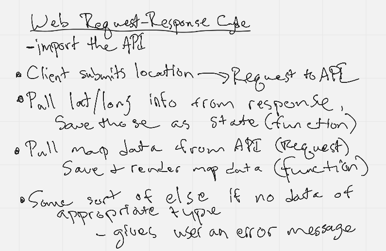
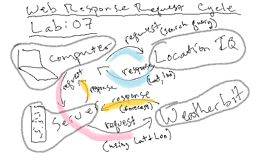
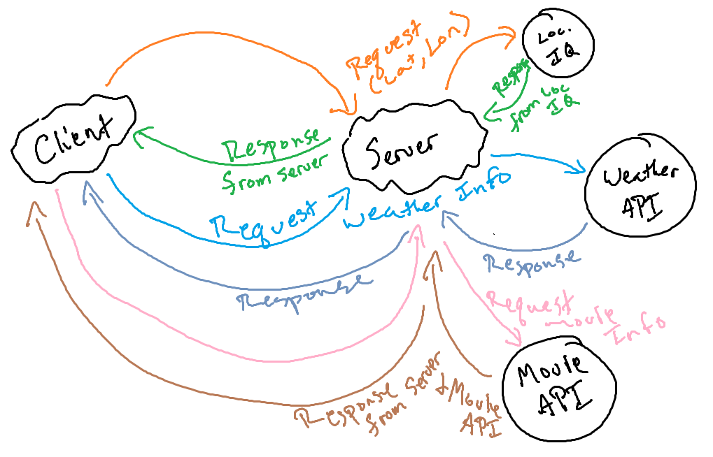

# City Explorer

>**Author**: Justin Hamerly
>**Version**: 1.0.0

## Overview

- City Explorer is an app that will allow someone to get a map and the coordinates for the location.

## Getting Started

- Submit your location and you can get a map and coordinates.

## Architecture

- Languages: Javascript, HTML
- Libraries: React
- Technologies: NodeJS

## Change Log

> *Version 1.0.0*
>
>- Features:
>- location input
>- map, name and coordinates
>- error response

## Credit and Collaborations

Classmates: Patrick Laurion, Sarah Creager, Antoine Charette

## Time Estimates

>Name of feature: API hookup, map generation, error response
>
>Estimate of time needed to complete: 4 hours
>
>Start time: 3:30pm
>
>Finish time: 7:23pm
>
>Actual time needed to complete: 3 hours, 53 min

>Name of feature: Connecting Server to front end and render weather data from the weather data file.
>
>Estimate of time needed to complete: 3.5 hours
>
>Start time: 2:30 pm
>
>Finish time: 9 PM
>
>Actual time needed to complete: 6.5 Hours

